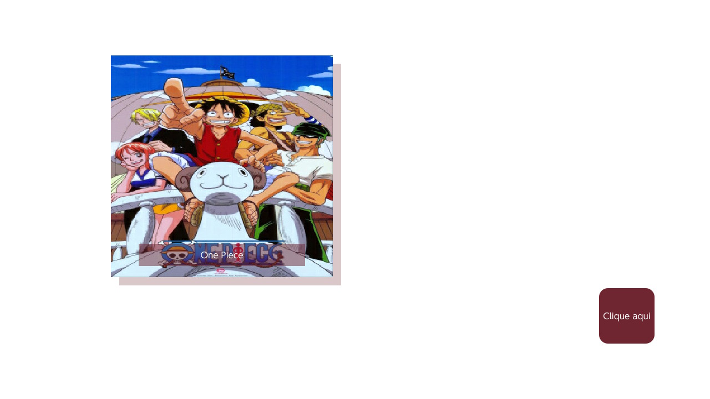

# Switch-Anime (Better name pending)

Simple POC, aims to develop a concise and easy to use library of components for NX.JS-based apps. It contains custom state management, simple web api integration, and most importantly simple components and styling.
## Contributing

Please feel free to make a pull request. 
You can also message me at [my email](mailto:joao.amadeu@unifio.edu.br) or [linkedin](https://www.linkedin.com/in/joao-walter-amadeu/)

## References
[nx.js](https://github.com/TooTallNate/nx.js)
## Images

